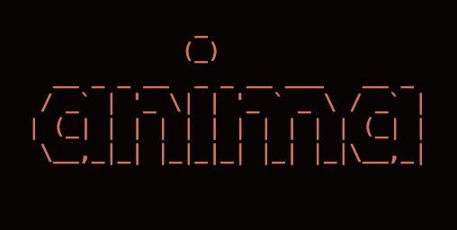
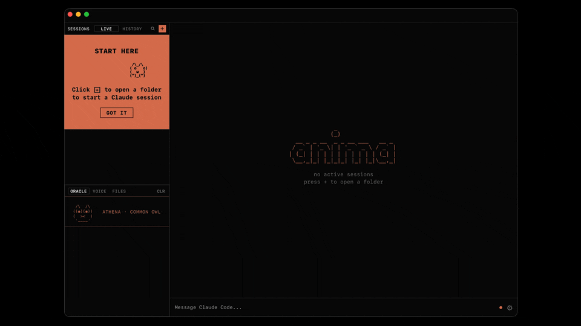
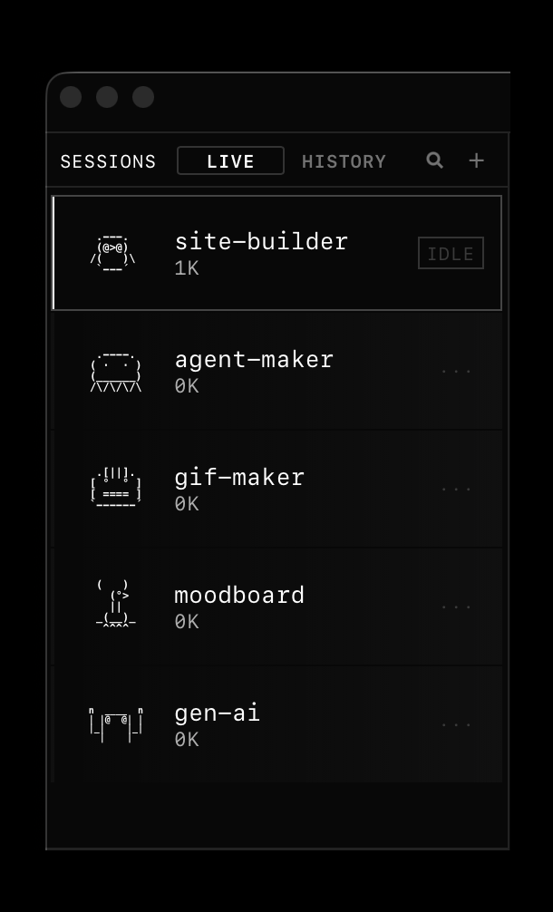
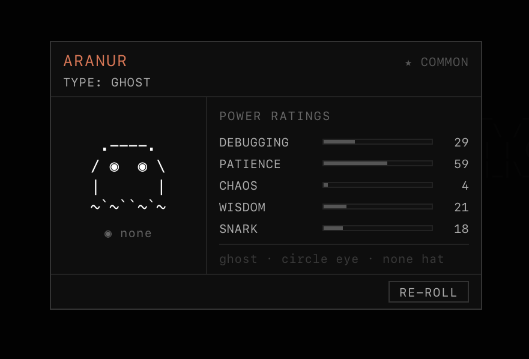
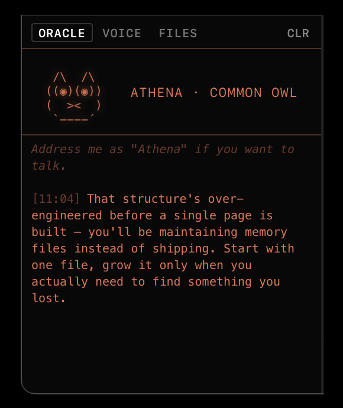

<h1 align="center">
    
</h1>

<h2 align="center" style="padding-bottom: 20px;">
  Your Claude Code environment, inhabited.
</h2>

<div align="center" style="margin-top: 25px;">

[](https://tauri.app)
[](https://www.apple.com/macos/)
[](LICENSE)
[](https://github.com/btangonan/pixel-terminal/releases)

</div>

<div align="center">
<a href="https://github.com/btangonan/pixel-terminal/releases">📦 Releases</a> • <a href="https://github.com/btangonan/pixel-terminal/discussions">💬 Discussions</a> • <a href="https://github.com/btangonan/pixel-terminal/issues">🐛 Issues</a> • <a href="CONTRIBUTING.md">🤝 Contributing</a>
</div>

<br/>

Anima is a native macOS app that wraps the Claude Code CLI and gives every session a companion — a generated pixel creature with its own name, species, and personality. They watch your work, fire commentary when something's off, and persist across sessions so your projects feel less like ephemeral processes and more like a place where things live.

The name comes from animism. Inhabited spaces teem with activity. Not sacred. Just alive.



## Features

- **One project, one companion** — every project gets a unique familiar generated from a weighted rarity pool. Two developers on the same codebase won't get the same creature.
- **Nim token economy** — 1 nim per 1000 tokens spent. Spend on re-rolls and new characters. Progress, not anxiety.
- **Collectible familiar cards** — each project gets a stat card: species, rarity, power ratings, session history. Like a Pokémon card for your codebase.
- **Cross-session watcher** — Rust daemon monitors all active Claude sessions simultaneously. Catches retry loops and read-heavy spirals in real time.
- **Oracle commentary** — companion fires contextual observations in a speech bubble. Selectable text — copy and paste into the session.
- **Voice input** — Bluetooth mic + push-to-talk. Hands-free Claude via WebSocket bridge.
- **Session history** — full session browser. Replay any past conversation. JSONL-backed.
- **Native performance** — Tauri v2 + Rust backend. Not Electron. Actual macOS app.

<p align="center">
  
</p>

## How it looks


**Sessions have faces.** Open a project and a companion appears — species drawn from a weighted rarity pool, personality seeded from the project path. Rare pulls happen.


**Token spend means something.** Every 1000 tokens earns 1 nim. Nim funds re-rolls, new companions, cosmetics. Not a limit to dread. A counter to fill.


**You're not working alone.** The watcher daemon tracks tool patterns across all active sessions. When it catches you going in circles, the companion says something. It's not *I'm stuck*. It's *we're stuck*.


*Commentary runs as short background prompts via the Claude CLI — capped at 2 concurrent calls. All processing is local; nothing leaves your machine except the API calls you'd make anyway.*

<div align="center">


</div>

## Requirements

- macOS 13 Ventura or later
- [Claude Code CLI](https://docs.anthropic.com/en/docs/claude-code) installed and authenticated
- Node.js 18+

## Getting Started

1. Download `Anima.dmg` from [Releases](https://github.com/btangonan/pixel-terminal/releases)
2. Open the app
3. Point it at a project directory and start a session

The companion generates on first session. Nim accrues automatically.

### Build from source

```bash
git clone https://github.com/btangonan/pixel-terminal
cd pixel-terminal
npm install
npm run tauri dev
```

Production build:

```bash
npm run tauri build
# Output: src-tauri/target/release/bundle/
```

Rust tests:

```bash
cd src-tauri && cargo test
```

## How It Works

Anima is a Tauri v2 desktop app. The frontend is vanilla JS — no framework, no bundler. The Rust backend handles file I/O, path security, companion sync, and the cross-session watcher. A WebSocket bridge handles voice input.

The watcher (`daemon.rs`) is a Tokio async loop that polls Claude Code's session feed, tracks tool sequences across all active sessions, and emits companion commentary via Tauri events when patterns fire. The oracle — the voice behind the companion bubble — is a `claude -p` subprocess with personality context injected from your companion's species and stats.

Full architecture notes: [`docs/architecture.md`](docs/architecture.md)

## Contributing

Issues and PRs welcome. See [`.github/ISSUE_TEMPLATE`](.github/ISSUE_TEMPLATE) for bug report and feature request templates.

Alpha software. Solo project. Breaking changes happen.

## License

MIT © [Bradley Tangonan](https://github.com/btangonan)
