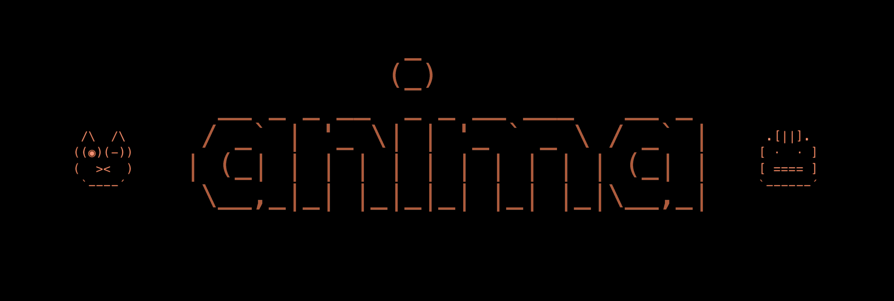

<h1 align="center">
    
</h1>

<h2 align="center" style="padding-bottom: 20px;">
  Your Claude Buddy needs friends.
</h2>

<div align="center" style="margin-top: 25px;">

[](https://tauri.app)
[](https://www.apple.com/macos/)
[](LICENSE)
[](https://github.com/btangonan/anima/releases)

</div>

<div align="center">
<a href="https://github.com/btangonan/anima/releases">📦 Releases</a> • <a href="https://github.com/btangonan/anima/discussions">💬 Discussions</a> • <a href="https://github.com/btangonan/anima/issues">🐛 Issues</a> • <a href="CONTRIBUTING.md">🤝 Contributing</a>
</div>

<br/>

Anima turns your Claude buddy into an oracle. A cross-session code supervisor running the full Claude model, inside a native macOS app. It watches tool patterns across every active session, catches retry loops and read-heavy spirals before you've noticed them, and surfaces observations you can select and paste straight into the conversation.

Claude Code ships with a basic buddy. An ASCII creature that hatches in your terminal, watches you work, and occasionally drops a line in a speech bubble. It's charming. It's also limited: the buddy can't see across sessions, can't remember what happened last time, its commentary comes from a small model working with a 5,000-character window, and the speech bubble text can't be copied or pasted back into your session.

Each project folder also gets its own familiar. An ASCII companion that animates while Claude is working, so you can see at a glance which sessions are done and waiting on you. Every 1,000 tokens earns 1 nim. Spend it to re-roll for a new species, rarity, and personality.

<p align="center">

</p>

<p align="center">

</p>

## Features

- **One project, one companion.** Every project gets a unique familiar generated from a weighted rarity pool. Two developers on the same codebase won't get the same creature.
- **Nim token economy.** 1 nim per 1000 tokens spent. Spend on re-rolls and new characters.
- **Collectible familiar cards.** Each project gets a stat card: species, rarity, power ratings, session history.
- **Cross-session watcher.** Rust daemon monitors all active Claude sessions simultaneously. Catches retry loops and read-heavy spirals in real time.
- **Oracle commentary.** Companion fires contextual observations in a speech bubble. Selectable text you can paste straight into the session.
- **Voice input.** Bluetooth mic + push-to-talk. Hands-free Claude via WebSocket bridge.
- **Session history.** Full session browser. Replay any past conversation. JSONL-backed.
- **Native performance.** Tauri v2 + Rust backend. Actual macOS app, 4MB binary.

## How it looks

<p align="center">

</p>

**The watcher sees what you miss.** The daemon tracks tool patterns across all active sessions. When it catches you going in circles, the companion says something.

<p align="center">

</p>

*Commentary runs as short background prompts via the Claude CLI, capped at 2 concurrent calls. All processing is local; nothing leaves your machine except the API calls you'd make anyway.*

<p align="center">


</p>

## Requirements

- macOS 13 Ventura or later
- [Claude Code CLI](https://docs.anthropic.com/en/docs/claude-code) installed and authenticated
- Node.js 18+

## Getting Started

1. Download `Anima.dmg` from [Releases](https://github.com/btangonan/anima/releases)
2. Open the app
3. Point it at a project directory and start a session

The companion generates on first session. Nim accrues automatically.

### Build from source

```bash
git clone https://github.com/btangonan/anima
cd anima
npm install
npm run tauri dev
```

Production build:

```bash
npm run tauri build
# Output: src-tauri/target/release/bundle/
```

Rust tests:

```bash
cd src-tauri && cargo test
```

## How It Works

Anima is a Tauri v2 desktop app. The frontend is vanilla JS, no framework, no bundler. The Rust backend handles file I/O, path security, companion sync, and the cross-session watcher. A WebSocket bridge handles voice input.

The watcher (`daemon.rs`) is a Tokio async loop that polls Claude Code's session feed, tracks tool sequences across all active sessions, and emits companion commentary via Tauri events when patterns fire. The oracle (the voice behind the companion bubble) is a `claude -p` subprocess with personality context injected from your companion's species and stats.

Full architecture notes: [`docs/architecture.md`](docs/architecture.md)

## Contributing

Issues and PRs welcome. See [`.github/ISSUE_TEMPLATE`](.github/ISSUE_TEMPLATE) for bug report and feature request templates.

Alpha software. Solo project. Breaking changes happen.

## License

MIT © [Bradley Tangonan](https://github.com/btangonan)
